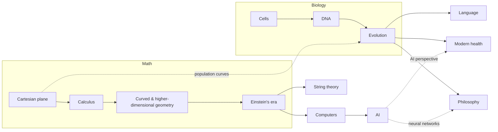

# Connections

How the subjects build on each other and what they roll up to. Each track is
also the story arc for that subject's movie.

## Math → string theory and computers

Everything starts on the Cartesian plane: once numbers become points, every
equation becomes a picture. Each step after that stretches the plane further.

| Step | What changed | Where it lives |
|---|---|---|
| Descartes (1637) | Algebra and geometry merge: an equation is a curve | Algebra |
| Newton & Leibniz (1680s) | Slopes and areas on the plane become calculus | Precalculus & Calculus |
| Gauss & Riemann (1800s) | The plane can curve and have any number of dimensions | Linear Algebra, Proof-Based Math |
| Einstein's era (1900–1950) | A group of mathematicians and physicists take math to the next level (below) | Relativity, Quantum Mechanics, Computer Science |

**The Einstein-era group** (centered on Göttingen, then Princeton's Institute
for Advanced Study, where Einstein, Gödel, and von Neumann all worked):

- **Minkowski** – space and time become one 4-D coordinate system (spacetime).
- **Einstein** – uses Riemann's curved geometry for general relativity (1915).
- **Hilbert** – infinite-dimensional spaces, later the math of quantum mechanics.
- **Noether** – every symmetry gives a conservation law (1918).
- **Gödel** – some true statements can never be proven (1931).
- **Turing** – defines what any machine can compute (1936).
- **von Neumann** – quantum math, and the stored-program design every modern
  computer still uses (1945).

**It splits into two roll-ups:**

- **String theory** – relativity's geometry + quantum mechanics + Noether's
  symmetries, pushed to extra dimensions. Developed from the 1970s on; still an
  unconfirmed candidate theory, and the agent should grade students on knowing
  that.
- **Computers** – Turing → von Neumann → Shannon's information theory (1948) →
  modern computers → AI.

## Biology → philosophy, language, and modern health

Cells → DNA → evolution, then three roll-ups:

- **Philosophy** – what life is, what a mind is, and bioethics.
- **Language** – how language evolved, how the brain produces it, and DNA as a
  code that is read and translated.
- **Modern health** – genomics, vaccines, gene editing (CRISPR), and medicine.

## Where biology meets math and computers

- **Population** – Darwin got the idea for natural selection after reading
  Malthus on population growth (1838). Exponential vs. limited (logistic)
  growth curves, Hardy–Weinberg (1908, co-written by a mathematician), and
  Fisher's statistics all plot on the Cartesian plane.
- **Computers + AI today** – neural networks started as a model of neurons
  (McCulloch & Pitts, 1943); computers made genome sequencing possible;
  AlphaFold predicts protein shapes (2020); AI now reads scans and helps find
  drugs.
